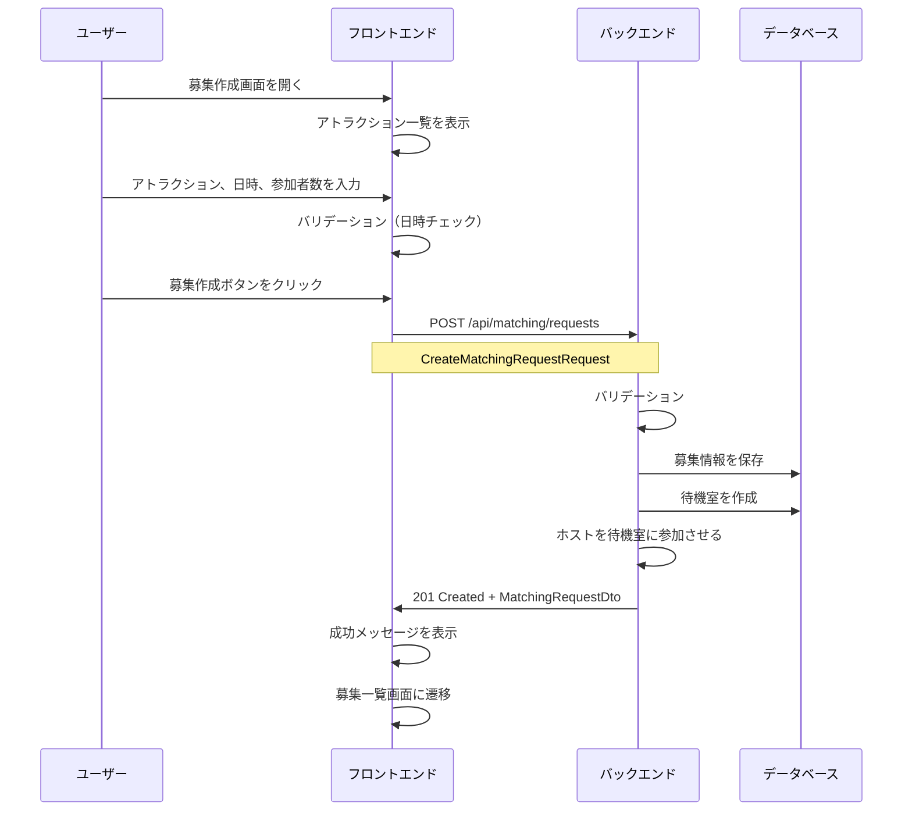
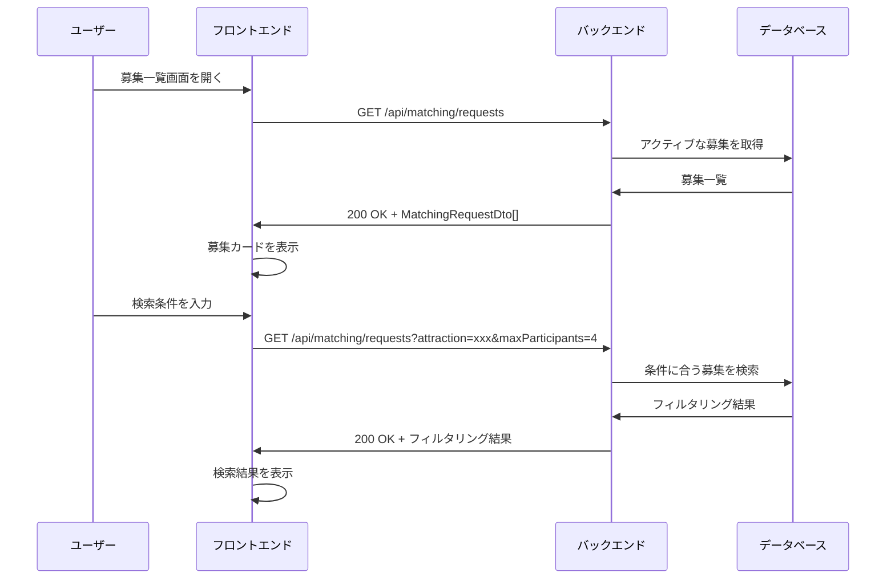
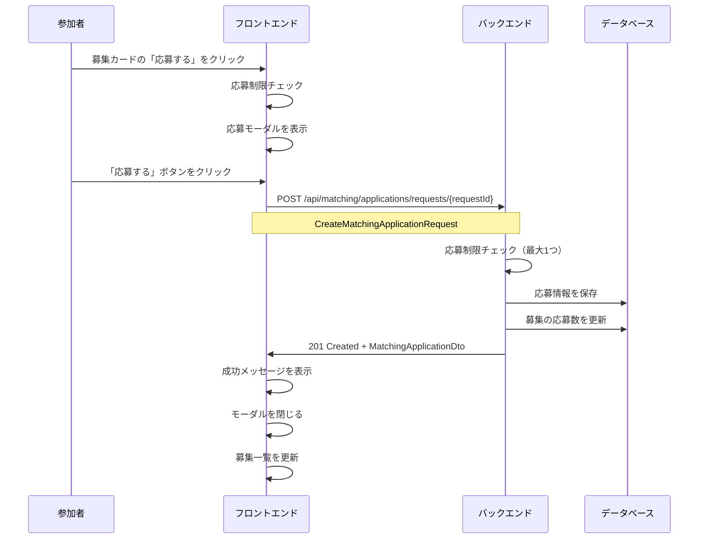
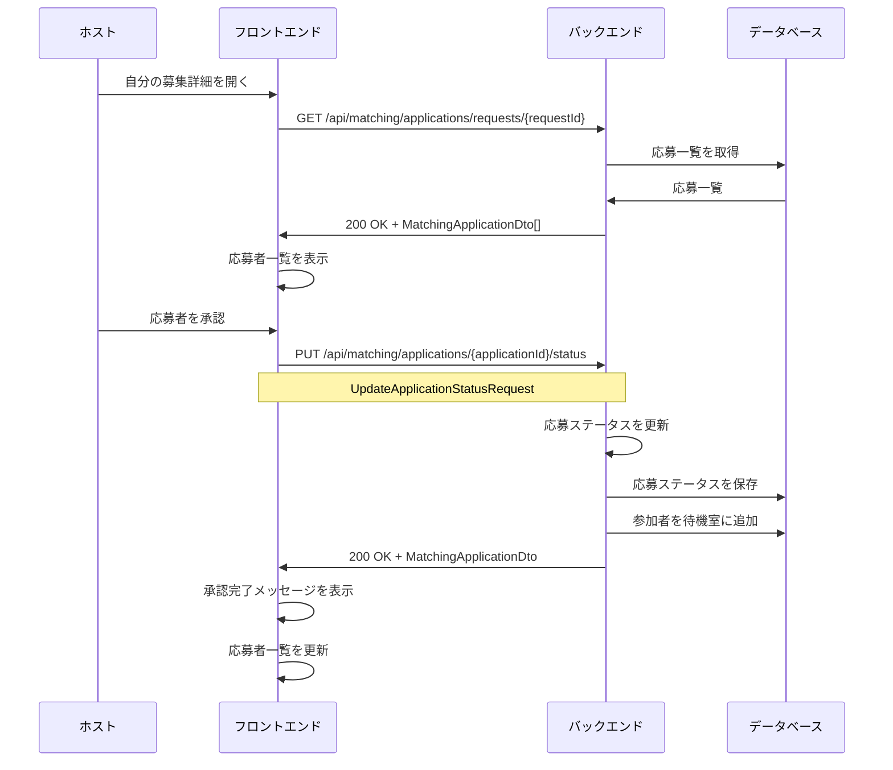
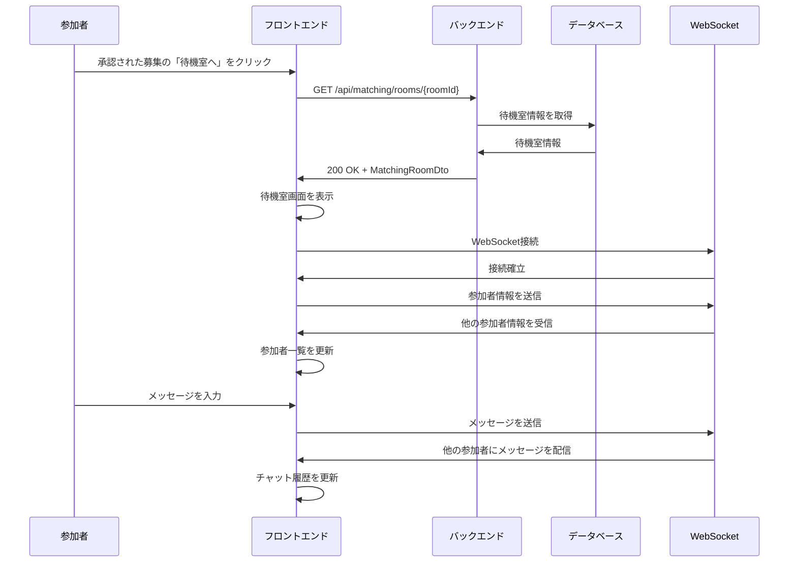
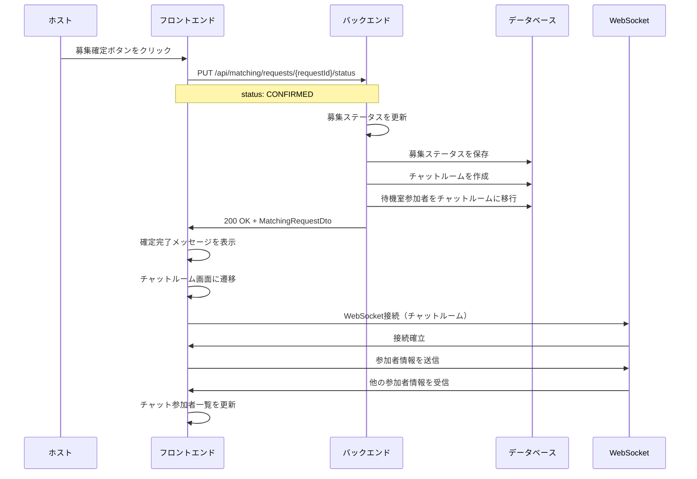
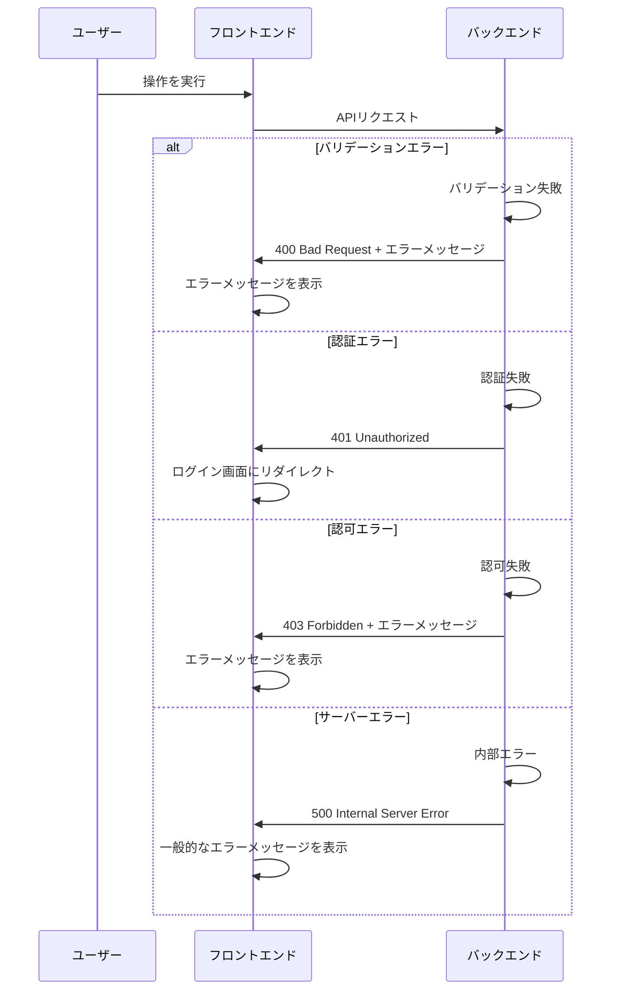
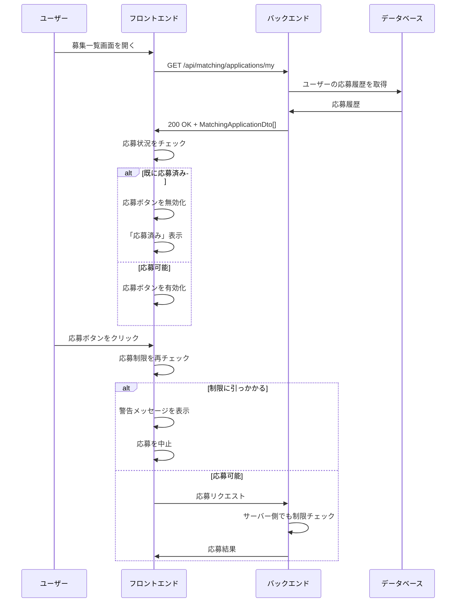
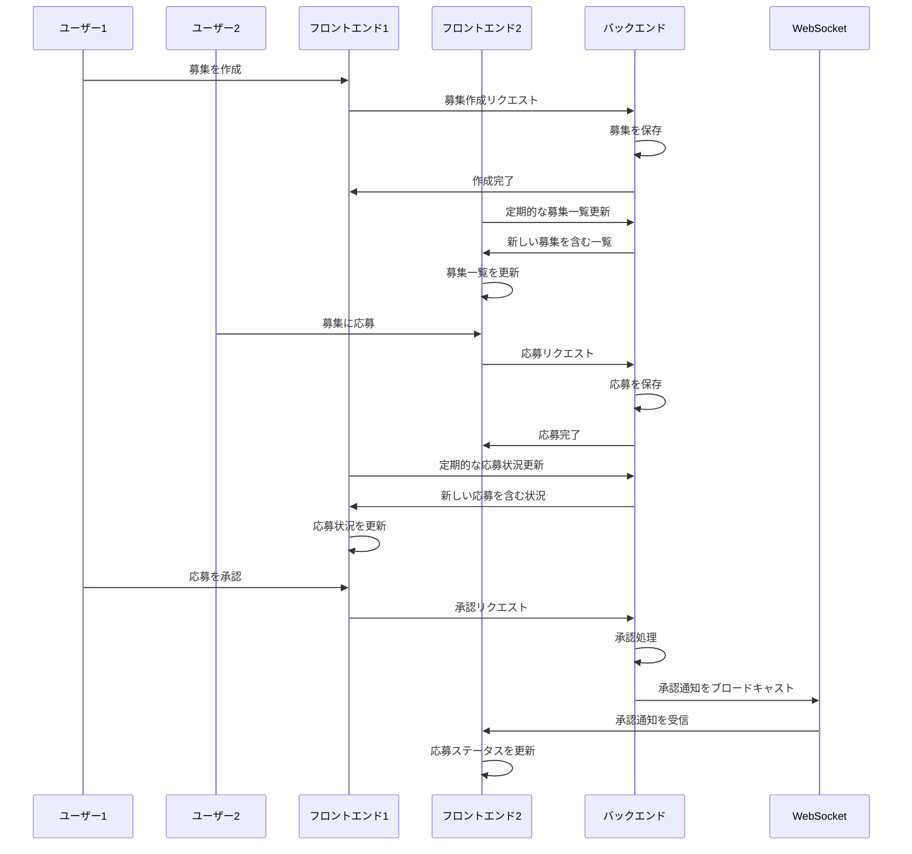

# マッチングシステム シーケンス図

## 1. 募集作成フロー

## 2. 募集一覧表示・検索フロー

## 3. 応募フロー

## 4. 応募承認フロー（ホスト側）

## 5. 待機室参加フロー

## 6. 募集確定・チャットルーム移行フロー

## 7. エラーハンドリングフロー

## 8. 応募制限チェックフロー

## 9. リアルタイム更新フロー

これらのシーケンス図は、マッチングシステムの主要なフローを視覚的に表現しています。各フローは実際の実装に基づいて作成されており、フロントエンドとバックエンドの連携、データベース操作、WebSocket通信などが含まれています。
